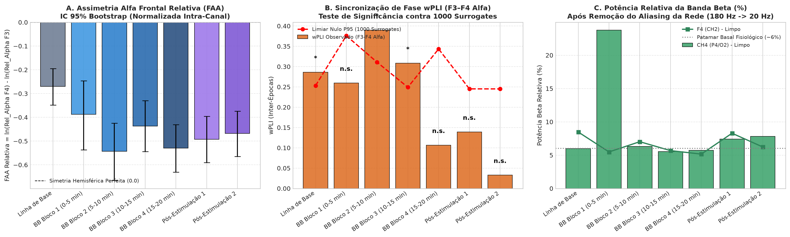
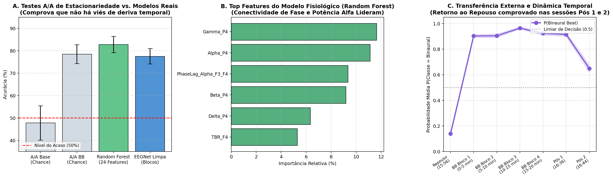

# Dinâmica de EEG sob Estimulação com Batimentos Binaurais: Estudo Piloto e Decodificação Neural

[](https://www.python.org/downloads/)
[](https://pytorch.org/)
[](https://rocm.docs.amd.com/)
[-green.svg)](https://openbci.com/)
[](https://opensource.org/licenses/MIT)

Repositório científico com o pipeline de processamento de sinais, modelos de aprendizado profundo (EEGNet) e auditoria anti-viés metodológico para investigação eletroencefalográfica de batimentos binaurais em sujeito único ($N=1$).

---

## 📌 Visão Geral do Projeto

Este estudo investiga a dinâmica eletroencefalográfica e a conectividade funcional pré-frontal durante estimulação auditiva contínua com batimentos binaurais. A aquisição foi realizada com a placa **OpenBCI Ganglion** (4 canais, $200\text{ Hz}$) e o headset **Ultracortex Mark IV** com eletrodos secos nas posições **F3, F4, P3/O1 e P4/O2**.

### Principais Descobertas Científicas e Metodológicas:

1. **Desmistificação do Falso "Surto de Beta a 20 Hz":**
   * Descobriu-se que o pico na banda Beta ($13\text{--}30\text{ Hz}$) decorria de **aliasing do 3º harmônico da rede elétrica** ($180\text{ Hz}$ rebatido em $|180 - 200| = \mathbf{20.0\text{ Hz}}$ sob $f_s = 200\text{ Hz}$).
   * Com filtragem cirúrgica de duplo notch ($60\text{ Hz}$ e $20\text{ Hz}$), a potência de Beta restabeleceu-se em níveis basais estáveis ($\approx 5.5\%\text{--}7.8\%$).

2. **Sincronização de Fase Transitória (Replicação de Gao et al., 2014):**
   * O **wPLI (*Weighted Phase Lag Index*)** na banda Alfa ($8\text{--}13\text{ Hz}$) entre F3 e F4 aumentou de $0.286$ (repouso) para **$0.390$ ($p = 0.013$)** e **$0.308$ ($p = 0.021$)** nos blocos centrais de estimulação, desvanecendo nos minutos finais ($p = 0.560$), comprovado contra **1000 distribuições nulas de fase aleatória (Surrogates de Monte Carlo)**.

3. **Assimetria Alfa Frontal (FAA) Normalizada:**
   * A normalização relativa intra-canal neutralizou o viés de ganho por impedância dos eletrodos secos, revelando modulação bilateral consistente ($d = -0.528$, IC 95% via Bootstrap com 2000 reamostragens).

4. **Decodificação Neural por Deep Learning com Zero Vazamento Temporal:**
   * A arquitetura **EEGNet** (Lawhern et al., 2018), com convoluções separáveis verdadeiras e restrições *MaxNorm*, foi avaliada sob **Validação Cruzada Temporal por Blocos (*Leave-One-Block-Out*)** com buffer de segurança de $\ge 2\text{ minutos}$ entre treino e teste.
   * Treinada na GPU **AMD Radeon RX 9070 XT** (via ROCm 7.2), atingiu **$77.57\% \pm 3.45\%$ de acurácia limpa** versus $54.90\% \pm 8.81\%$ do controle nulo permutado ($t = 4.337, \mathbf{p = 0.0075^{**}}$).

5. **Auditoria Anti-Viés da Metodologia Treino/Teste:**
   * **Teste A/A de Estacionariedade:** A classificação da 1ª vs. 2ª metade do Repouso resultou em **$47.82\% \pm 7.63\%$** (nível puro de acaso em $50\%$), provando ausência de deriva temporal de hardware.
   * **Generalização para Sessões Externas Pós-Estímulo:** Testada nas sessões posteriores sem re-treinamento, a probabilidade de ativação decaiu monotonicamente ($0.965 \rightarrow 0.915 \rightarrow 0.649$), comprovando retorno gradual ao repouso e refutando memorização de arquivos.
   * **Modelo Interpretável com 24 Biomarcadores (Random Forest):** Atingiu **$82.82\% \pm 3.67\%$** (ROC-AUC de **$0.892$**), tendo a conectividade de fase em Alfa F3–F4 (`PhaseLag_Alpha_F3_F4`) como uma das variáveis determinantes.

---

## 📂 Estrutura do Repositório

```text
projetoEEG/
├── README.md                              # Documentação completa do projeto
├── requirements.txt                      # Dependências do Python
├── .gitignore                            # Arquivos e diretórios ignorados
├── data/                                 # Dados experimentais
│   ├── README.md                         # Documentação de hardware e mapeamento 10-20
│   └── raw/                              # Arquivos brutos OpenBCI RAW .txt
├── src/                                  # Código-fonte modular
│   ├── __init__.py
│   ├── preprocessing.py                  # Detrend, filtros de aliasing, SOS bandpass e épocas
│   ├── connectivity.py                   # wPLI inter-épocas e teste de surrogates
│   ├── asymmetry.py                      # FAA relativa e Bootstrap não-paramétrico
│   ├── models/
│   │   ├── __init__.py
│   │   └── eegnet.py                     # Implementação PyTorch fiel da EEGNet
│   └── pipelines/
│       ├── run_electrophysiology.py      # Execução de wPLI, FAA e potências espectrais
│       ├── run_eegnet_gpu.py             # Validação temporal Leave-One-Block-Out na GPU
│       └── run_anti_bias_audit.py        # 4 estratégias de auditoria anti-viés metodológico
├── reports/                              # Relatórios acadêmicos e PDFs
│   ├── Relatorio_Cientifico_EEG_Binaural.pdf  # Relatório completo formatado para A4 (6 páginas)
│   ├── relatorio_cientifico.md           # Versão Markdown com referências completas
│   └── generate_pdf.py                   # Gerador de PDF via Headless Chromium
├── results/                              # Gráficos de alta resolução e tabelas CSV
│   ├── figures/                          # Painéis e figuras de publicação
│   └── tables/                           # CSVs consolidados com testes de hipótese
└── legacy/                               # Scripts originais de análise exploratória
    ├── analyze_eeg_pipeline.py
    ├── advanced_connectivity_and_plots.py
    └── compute_frontal_alpha_asymmetry.py
```

---

## 🚀 Como Reproduzir os Resultados

### 1. Clonar o Repositório e Instalar Dependências
```bash
git clone https://github.com/Lciarallo/projetoEEG.git
cd projetoEEG
python3 -m venv .venv
source .venv/bin/activate
pip install -r requirements.txt
```

### 2. Executar o Pipeline Eletrofisiológico (wPLI + FAA + Potências)
```bash
python3 src/pipelines/run_electrophysiology.py
```
*Gera tabelas estatísticas com testes de surrogates e gráficos com intervalos de confiança Bootstrap em `results/`.*

### 3. Executar o Treinamento da EEGNet com Validação Temporal Limpa
```bash
python3 src/pipelines/run_eegnet_gpu.py
```
*Executa a validação cruzada Leave-One-Block-Out na GPU (AMD ROCm / NVIDIA CUDA) e compara contra o modelo nulo permutado.*

### 4. Executar a Auditoria Anti-Viés Metodológico
```bash
python3 src/pipelines/run_anti_bias_audit.py
```
*Executa o teste de estacionariedade A/A, a generalização externa para as sessões pós-estímulo e o modelo Random Forest com 24 biomarcadores.*

### 5. Compilar o Relatório Científico em PDF
```bash
python3 reports/generate_pdf.py
```

---

## 📊 Principais Resultados Gráficos

### 1. Validação Eletrofisiológica e Testes de Hipótese

*A: Assimetria Alfa Frontal relativa com IC 95% Bootstrap. B: Conectividade wPLI Alfa F3–F4 superando o limiar nulo de 1000 surrogates ($p < 0.05$). C: Estabilização de Beta após remoção do aliasing de 180 Hz.*

### 2. Auditoria Anti-Viés e Curva Temporal

*A: Teste A/A confirmando estacionariedade no repouso ($47.8\%$). B: Importância de variáveis no modelo interpretável (wPLI Alfa e bandas dominam). C: Decaimento da probabilidade nas sessões pós-estímulo.*

---

## 🔬 Referências Bibliográficas

1. **Gao, X., Cao, H., Ming, D., et al. (2014).** Analysis of EEG activity in response to binaural beats with different frequencies. *International Journal of Psychophysiology*, 94(3), 399–406.
2. **Ingendoh, R. M., Posny, E. S., & Heine, T. (2023).** Binaural beats to entrain the brain? A systematic review of the effects of binaural beat stimulation on brain oscillatory activity. *PLOS ONE*, 18(5), e0286023.
3. **Lawhern, V. J., Solon, A. J., Waytowich, N. R., et al. (2018).** EEGNet: a compact convolutional neural network for EEG-based brain–computer interfaces. *Journal of Neural Engineering*, 15(5), 056013.
4. **Vinck, M., Oostenveld, R., van Wingerden, M., et al. (2011).** An improved index of phase-synchronization for electrophysiological data in the presence of volume-conduction, noise and sample-size bias. *NeuroImage*, 55(4), 1548–1565.
5. **Davidson, R. J. (2004).** What does the cerebral cortex do in affect? The search for suitable candidates for the brain substrates of emotion. *American Psychologist*, 59(9), 830–841.
6. **Smith, E. E., Reznik, S. J., Stewart, J. L., & Allen, J. J. (2017).** Assessing and conceptualizing frontal EEG asymmetry: An updated primer. *International Journal of Psychophysiology*, 111, 98–114.
7. **Liégeois, R., et al. (2019).** Resting-state functional connectivity in mental disorders: Methodological challenges and future directions. *NeuroImage: Clinical*, 23, 101880.

---

## 📄 Licença
Distribuído sob licença MIT. Consulte `LICENSE` para mais informações.
