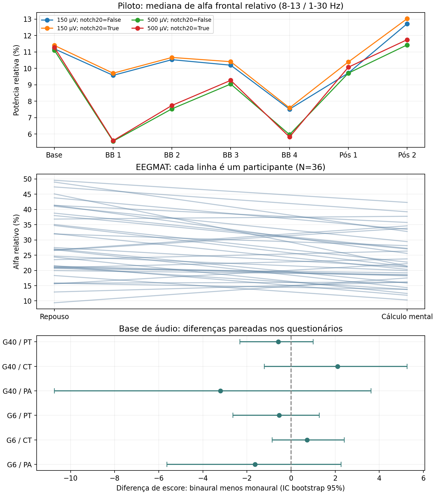

# Áudio binaural e relaxamento: relatório científico consolidado

**Revisão de 29/09/2026.** Reanálise exploratória de quatro registros OpenBCI atribuídos a um participante, com duas bases públicas independentes. Consulte os [resultados da auditoria](../results/audit_2026_09_26/), da [validação externa](../results/validation_2026_09_28/) e da [revisão crítica](../results/critical_2026_09_29/). O [estudo externo de 28/09](estudo_relaxamento_validacao_externa.md) registra uma etapa anterior.

## Resumo

**O efeito do áudio binaural sobre o relaxamento desta pessoa permanece indeterminado.** O programa antigo exibiu “Aproximação/Relaxamento” nos quatro blocos com áudio, mas também na linha de base, antes do áudio. Reproduzimos esse resultado dos arquivos brutos. Há diferenças de EEG ao longo da sessão; elas não permitem afirmar que o som causou relaxamento, nem que não teve efeito. Condição, ordem temporal e arquivo coincidem, e faltam áudio controle, medida direta de relaxamento e marcador independente do som. Épocas e blocos de uma pessoa não são réplicas independentes.

O alfa frontal relativo foi menor nos quatro blocos rotulados BB que na Base. A proporção de janelas com FAA positiva, calculada pela regra do programa antigo, é sensível ao corte de amplitude. Ao exigir 80% de épocas válidas por bloco de 30 s, BB 1 e BB 2 ficam com apenas um bloco cada; BB 3 e BB 4 mantêm quedas descritivas. Na EEGMAT, alfa distingue repouso de cálculo mental em 36 pessoas, mas essa base não mede relaxamento percebido. Nos dados de [Sudre et al. (2024)](https://journals.plos.org/plosone/article?id=10.1371/journal.pone.0306427), o contraste binaural-monaural não forneceu vantagem conclusiva nesta reanálise. Ausência de significância não demonstra equivalência.

## 1. Pergunta e desenho

A pergunta é **se o binaural altera o relaxamento**. Três resultados precisam ser separados: (1) os registros de EEG têm diferenças descritivas; (2) o programa antigo atribuiu um rótulo de “Estado”; (3) a sensação de relaxamento e a causa de uma eventual mudança não foram medidas de modo que possam ser identificadas. Para avaliar um efeito causal específico, seria preciso comparar com áudio controle em sessões repetidas e medir relaxamento diretamente. Os quatro CSVs locais são rotulados Base, BB, Pós 1 e Pós 2. A atribuição a uma pessoa, a montagem e os nomes das condições vêm da documentação; não há marcador de estímulo no sinal que os confirme. A posição dos canais posteriores P3/O1 e P4/O2 é ambígua.

A [EEGMAT 1.0.0](https://physionet.org/content/eegmat/1.0.0/) contém registros antes e durante cálculo mental: testa descritores entre tarefas, sem validar uma escala de relaxamento. [Sudre et al.](https://journals.plos.org/plosone/article?id=10.1371/journal.pone.0306427) disponibilizaram questionários e potências de EEG derivadas para áudio monaural C0 e binaural C1, em grupos de 6 e 40 Hz. É um contraste acústico pertinente, com protocolo, participantes e canais diferentes dos do piloto. O [plano externo](plano_validacao_externa.md) foi escrito antes dos resultados de 28/09; as sensibilidades de 29/09 são posteriores e exploratórias.

## 2. Integridade e cronologia local

| Arquivo / condição | Amostras | Duração gravada | Lacuna anterior |
| --- | --- | --- | --- |
| Base | 69786 | 349.0 s | - |
| BB | 245118 | 1226.7 s | 125.4 s |
| Pós 1 | 62216 | 311.1 s | 642.0 s |
| Pós 2 | 63776 | 318.9 s | 181.2 s |

Os intervalos vêm dos timestamps Unix dos CSVs. Existem **642 s (10 min 42 s) sem EEG entre o fim do arquivo BB e o início do Pós 1**. Como não se sabe quando o áudio foi desligado, “recuperação imediata” não é uma interpretação verificável. Mesmo supondo reprodução contínua durante todo o arquivo BB, a ausência de marcador impede verificar o instante real do estímulo e a ausência de uma condição acústica controle impede separar o efeito binaural de outros efeitos de ouvir um som. Timestamps repetem-se em aproximadamente metade das linhas, sem regressão observada na auditoria; as análises usam a ordem das amostras e 200 Hz nominais. Não há registro independente de olhos abertos/fechados, impedância, intensidade sonora ou movimento ocular.

## 3. Métodos e unidades de análise

A comparação com EEGMAT usa F3/F4, filtro 1-30 Hz por janela, reamostragem a 200 Hz quando necessária, remoção de 2 s nas bordas e épocas sem sobreposição de 2 s. O critério principal rejeita amplitude pico a pico frontal abaixo de 2 µV ou acima de 150 µV. Cada janela local de cinco minutos gera 148 épocas candidatas. Alfa relativo usa potência 8-13 Hz sobre 1-30 Hz; theta relativo usa 4-8 Hz no mesmo denominador. Também se calcularam ln(alfa/beta baixa) e assimetria alfa frontal. **Nenhum deles, isoladamente, é escala validada de relaxamento.**

A auditoria eletrofisiológica anterior usa outro processamento: notch de 60 Hz, opção de notches de 20/80 Hz, filtro 1-45 Hz e 150 épocas candidatas por bloco de cinco minutos. As duas análises não devem ter contagens e valores misturados. O notch de 20 Hz testa sensibilidade a possível interferência sem identificar sua origem. A rejeição por amplitude usa somente os canais frontais.

Nos dados externos, primeiro se agrega por pessoa e condição. Os testes reescritos usam a média das diferenças pareadas e inversões bilaterais do sinal **dentro de cada pessoa**: exatas até 17 pares e por 99.999 sorteios fixos nas amostras maiores. Holm corrige, separadamente, quatro indicadores EEGMAT, seis questionários Sudre, dois contrastes de EEG F3/Fz/F4 e dois de Fz. A interpretação pressupõe intercambialidade dos rótulos. A ordem repouso→tarefa foi fixa na EEGMAT; em Sudre podem existir efeitos de período e da sessão anterior. Esses testes posteriores não são confirmação pré-registrada.

## 4. Estados exibidos pelo programa antigo e EEG local

Em [compute_frontal_alpha_asymmetry.py](../legacy/compute_frontal_alpha_asymmetry.py), o “Estado” é uma regra aplicada à assimetria alfa frontal (FAA) de **potência absoluta**: `FAA = ln(alfa F4) - ln(alfa F3)`. Para `FAA > 0`, o programa escreve **“Predomínio Esquerdo (Aproximação/Relaxamento)”**; nos demais casos, **“Predomínio Direito (Evitação/Alerta)”**. Ele não recebe dados do reprodutor de áudio, não foi calibrado contra relatos de calma e não calcula a mudança de estado causada pelo som. A tabela abaixo reproduz a [saída histórica](../results/tables/tabela_assimetria_alfa_frontal.csv) diretamente dos quatro arquivos brutos; a última coluna usa a mesma regra da curva temporal do programa e conta janelas móveis de 8 s, com passo de 2 s, **inteiramente contidas em cada condição**. Consulte a [auditoria reproduzível](../results/critical_2026_09_29/legacy_state_audit.csv).

| Condição | FAA legado | Estado exibido | Janelas 8 s com FAA > 0 |
| --- | --- | --- | --- |
| Base | +1.956 | Aproximação/Relaxamento | 47/171 (27.5%) |
| BB 1 | +0.465 | Aproximação/Relaxamento | 106/146 (72.6%) |
| BB 2 | +3.221 | Aproximação/Relaxamento | 109/146 (74.7%) |
| BB 3 | +1.620 | Aproximação/Relaxamento | 101/146 (69.2%) |
| BB 4 | +1.748 | Aproximação/Relaxamento | 74/146 (50.7%) |
| Pós 1 | +4.259 | Aproximação/Relaxamento | 20/152 (13.2%) |
| Pós 2 | +1.977 | Aproximação/Relaxamento | 54/156 (34.6%) |

**Leitura do rótulo:** todas as sete condições receberam “Aproximação/Relaxamento”, inclusive a Base. Portanto, a tabela do programa **não registra uma passagem de “não relaxado” para “relaxado” quando o áudio começa**. Ela também não significa que a pessoa permaneceu nesse estado ao longo de toda a gravação: na Base, 47 de 171 janelas móveis tiveram FAA positiva; no Pós 1, apenas 20 de 152, apesar do rótulo positivo da condição inteira. Isso ocorre porque o FAA da condição usa o logaritmo da razão de potências agregadas, enquanto a coluna de janelas conta sinais calculados separadamente. Janelas sobrepostas não são observações independentes, e o programa antigo não rejeita épocas por amplitude. Esses números descrevem a saída do algoritmo, sem teste válido do efeito do áudio.

### Sensibilidade ao corte de amplitude

Mantendo o filtro e a fórmula do programa antigo, excluí janelas móveis de 8 s cujo **maior pico a pico frontal (F3 ou F4)** excedia 150 ou 500 µV. Cada célula informa janelas com FAA positiva / janelas retidas; a contagem sem corte está na tabela anterior. São diagnósticos de sensibilidade escolhidos após a análise, não um detector validado de artefatos. Aplicar 150 µV à janela inteira de 8 s é mais restritivo que aplicar o mesmo limite a cada época de 2 s da reanálise principal. [Todas as condições e janelas sem sobreposição](../results/critical_2026_09_29/legacy_state_amplitude_sensitivity.csv) estão no CSV auditado.

| Condição | FAA > 0 com corte 150 µV | FAA > 0 com corte 500 µV |
| --- | --- | --- |
| Base | 22/138 (15.9%) | 26/146 (17.8%) |
| BB 1 | 6/12 (50.0%) | 97/137 (70.8%) |
| BB 2 | 4/24 (16.7%) | 62/99 (62.6%) |
| BB 3 | 27/56 (48.2%) | 71/116 (61.2%) |
| BB 4 | 4/63 (6.3%) | 56/127 (44.1%) |

Com 150 µV, BB 1 retém só 12 de 146 janelas candidatas; BB 2 retém 24 e BB 4, 63. A fração positiva de BB 2 (16,7%) fica próxima da Base (15,9%), e BB 4 (6,3%) fica abaixo. Com 500 µV, a direção descritiva volta a ser maior em BB que na Base, mas o número de janelas também muda. Um passo de 8 s, sem sobreposição, reduz a contagem; após o corte de 150 µV, BB 2 tem 0/6 janelas positivas e BB 4 tem 1/18. Essas escolhas não identificam qual janela contém artefato nem transformam janelas da mesma pessoa em réplicas independentes. **A alegação de “relaxamento” baseada na proporção de FAA positiva não é robusta a esse diagnóstico de amplitude.**

O nome “Relaxamento” no rótulo excede o que a FAA identifica. Em um [experimento com indução de raiva](https://pubmed.ncbi.nlm.nih.gov/11374750/), maior atividade frontal esquerda acompanhou raiva e comportamento de aproximação; logo, a direção da assimetria não é exclusiva de calma. O [estudo de Barry et al.](https://pubmed.ncbi.nlm.nih.gov/17911042/) mostra que abrir ou fechar os olhos altera a potência alfa; o estado dos olhos não foi registrado neste piloto. Essas fontes sustentam a necessidade de medir diretamente a experiência da pessoa e controlar o protocolo, sem indicar qual fator concreto produziu cada trecho do nosso EEG.

### Reanálise com potência relativa e controle de qualidade

A tabela seguinte usa outro processamento: filtro 1-30 Hz, potência **relativa**, épocas de 2 s e rejeição por amplitude frontal. A FAA é a mediana das épocas aceitas, não a razão entre potências agregadas do programa antigo. A direção dessa FAA relativa foi negativa em todas as condições. Aplicar mecanicamente os nomes de “Estado” do código antigo a essa outra medida produziria rótulos diferentes; **nenhuma das duas versões foi validada como detector individual de relaxamento**. Filtro, normalização, rejeição de épocas e agregação mudaram em conjunto, de modo que esta comparação não isola qual etapa explica a divergência.

| Condição | Épocas válidas / 148 | Alfa relativo | Theta relativo | ln(alfa/beta baixa) | FAA |
| --- | --- | --- | --- | --- | --- |
| Base | 142/148 | 11.19% | 15.78% | 0.703 | -0.247 |
| BB 1 | 74/148 | 9.57% | 14.79% | 0.383 | -0.389 |
| BB 2 | 80/148 | 10.53% | 15.94% | 0.624 | -0.514 |
| BB 3 | 106/148 | 10.19% | 16.38% | 0.461 | -0.412 |
| BB 4 | 103/148 | 7.51% | 15.15% | 0.549 | -0.614 |
| Pós 1 | 143/148 | 9.71% | 12.38% | 0.556 | -0.537 |
| Pós 2 | 124/148 | 12.72% | 15.01% | 0.600 | -0.376 |

São **medianas de épocas retidas**, não medidas de relaxamento. A retenção difere muito entre condições. Para verificar essa seleção, calculei alfa médio por bloco cronológico de 30 s e apliquei dois cortes mínimos. Δ é a diferença entre a média dos blocos da condição e da Base, em pontos percentuais:

| Condição | Blocos ≥50% | Δ alfa ≥50% (p.p.) | Blocos ≥80% | Δ alfa ≥80% (p.p.) |
| --- | --- | --- | --- | --- |
| Base | 10 | +0.00 | 9 | +0.00 |
| BB 1 | 5 | -2.39 | 1 | -4.61 |
| BB 2 | 7 | -2.47 | 1 | -1.28 |
| BB 3 | 8 | -1.60 | 5 | -2.14 |
| BB 4 | 8 | -4.78 | 4 | -4.59 |
| Pós 1 | 10 | -1.89 | 9 | -1.38 |
| Pós 2 | 9 | +1.37 | 7 | +1.89 |

Com 80% de retenção, BB 1 e BB 2 têm **um bloco aproveitável cada**; o valor não representa a condição inteira. BB 3 e BB 4 mantêm a direção negativa com cinco e quatro blocos. Blocos adjacentes continuam correlacionados, e a regra de seleção altera os trechos avaliados. Com uma gravação por condição não cabe p local confirmatório. A descrição do Pós também não demonstra retorno ao repouso, pois a latência desde o desligamento do áudio é desconhecida.

## 5. Validação dos indicadores na EEGMAT

Diferença positiva significa repouso maior que cálculo mental. Alfa e theta são mostrados em pontos percentuais de potência relativa; razão alfa/beta e FAA ficam em unidades logarítmicas.

| Indicador | Pessoas | Repouso - tarefa, média | p Holm |
| --- | --- | --- | --- |
| Alfa relativo | 36 | +5.69 p.p. | 0.00032 |
| Theta relativo | 36 | -2.16 p.p. | 0.01467 |
| ln(alfa/beta baixa) | 36 | +0.07 | 0.50680 |
| FAA relativa | 36 | +0.03 | 0.50680 |

O alfa foi maior no repouso em 27 das 36 pessoas. A direção persiste ao trocar a janela de repouso:

| Repouso | Pessoas | Alfa repouso - tarefa | Direção positiva |
| --- | --- | --- | --- |
| Primeiros 60 s | 36 | +6.22 p.p. | 27/36 |
| Últimos 60 s | 36 | +5.69 p.p. | 27/36 |

Essas janelas são sensibilidades escolhidas após a primeira análise. A limpeza anterior pelos autores, os eletrodos e a tarefa diferem do piloto. A FAA relativa não apresentou diferença conclusiva entre repouso e cálculo mental nessa base (p Holm = 0,50680), outro motivo para não usar o limiar zero como classificador de calma. A regressão logística com uma pessoa inteira fora do treino por fold obteve **58.33% de acurácia balanceada** (ROC-AUC 0.614; p de 199 permutações por pessoa = 0.075). Isso não valida um detector individual de relaxamento. As probabilidades transferidas ao piloto não são “percentual de relaxamento”.

## 6. Binaural versus monaural em Sudre

Diferença positiva significa escore C1 maior que C0. Na codificação do artigo, valores maiores de PA, CT e PT indicam mais relaxamento, embora CT/PT mencionem “tensão”. As contagens vêm dos arquivos disponíveis; diferem parcialmente da amostra publicada, cujas exclusões não puderam ser reconstruídas integralmente.

| Grupo / escala | Pares | C1 - C0, média | p Holm |
| --- | --- | --- | --- |
| G6 / PA | 22 | -1.64 | 1.000 |
| G6 / CT | 22 | +0.73 | 1.000 |
| G6 / PT | 22 | -0.55 | 1.000 |
| G40 / PA | 19 | -3.21 | 1.000 |
| G40 / CT | 19 | +2.11 | 1.000 |
| G40 / PT | 19 | -0.58 | 1.000 |

Nenhuma das seis escalas apresentou contraste conclusivo após Holm **nesta comparação direta C1-C0**. O [artigo original de Sudre et al.](https://journals.plos.org/plosone/article?id=10.1371/journal.pone.0306427) relata melhora em alguns questionários após C1 em comparação com a avaliação pré-experimental; esse é outro contraste. Comparar C1 com C0 pergunta pela **vantagem específica do binaural sobre outro áudio**, enquanto comparar C1 com a avaliação anterior também pode captar passagem do tempo, expectativa e ouvir um som em geral. Não encontrar vantagem C1-C0 na nossa reanálise não prova ineficácia geral nem equivalência. Tampouco transfere automaticamente os resultados de outro protocolo e outras pessoas para este piloto.

No EEG, subtraiu-se a base de ruído de cada condição e comparou-se a média dos três blocos de estímulo C1-C0. A seleção estrita exige F3, Fz e F4 em todas as fases; a sensibilidade usa só Fz:

| Grupo | Canais | Pares | Delta alfa C1 - C0 | p Holm |
| --- | --- | --- | --- | --- |
| G6 | F3/Fz/F4 | 7 | -0.0209 | 0.156 |
| G6 | Fz | 13 | -0.0102 | 0.313 |
| G40 | F3/Fz/F4 | 5 | -0.0078 | 0.562 |
| G40 | Fz | 17 | +0.0023 | 0.649 |

A alternativa Fz muda simultaneamente participantes e canais. Em G40 a média muda de sinal, sem permitir atribuir a mudança somente ao sensor. A associação alfa-CT, com permutação exata por pessoa, não foi conclusiva: G6, N=7, rho=0.364, p Holm=0.467; G40, N=5, rho=-0.700, p Holm=0.467.

A diferença CT C1-C0 conforme a ordem dos sons foi:

| Grupo | Posição de C1 | Pessoas | CT C1 - C0, média |
| --- | --- | --- | --- |
| G6 | Antes de C0 | 12 | +1.08 |
| G6 | Depois de C0 | 10 | +0.30 |
| G40 | Antes de C0 | 11 | -1.00 |
| G40 | Depois de C0 | 8 | +6.38 |

A ordem foi randomizada no estudo original, mas estes subconjuntos são pequenos e a estratificação é posterior. A divergência descritiva não prova efeito de ordem; justifica medir e contrabalancear a sequência na próxima coleta.

## 7. O que os outros testes locais não demonstram

O índice de defasagem F3-F4 da auditoria é uma variante por época da parte imaginária de Hilbert, **não o wPLI espectral debiased**. Suas inversões de sinal por época pressupõem intercambialidade apesar da dependência temporal:

| Condição | Índice de defasagem | p Holm (7) |
| --- | --- | --- |
| Base | 0.286 | 0.1259 |
| BB 1 | 0.260 | 0.7512 |
| BB 2 | 0.390 | 0.0909 |
| BB 3 | 0.308 | 0.1349 |
| BB 4 | 0.107 | 1.0000 |
| Pós 1 | 0.139 | 0.9770 |
| Pós 2 | 0.033 | 1.0000 |

O menor p ajustado é 0.0909. Esses testes ocorrem **dentro de cada condição**, sem comparação direta BB-Base. O limiar de rejeição de 150 ou 500 µV altera os índices, inclusive o da Base. Diferença entre uma linha significativa e outra não significativa também não testaria a diferença entre condições.

Os classificadores temporais diagnosticam discriminação entre dois arquivos:

| Modelo | Acurácia balanceada (média ± DP) | Controle diagnóstico | ROC-AUC |
| --- | --- | --- | --- |
| EEGNet | 64.9% ± 21.0 p.p. | 50.9% | 0.708 |
| Random Forest | 69.8% ± 14.3 p.p. | 50.8% | 0.798 |

Os seis folds compartilham conjuntos de treino; o desvio é entre folds, não intervalo populacional. Cada classe corresponde a um arquivo e uma posição na sequência. A filtragem bidirecional da sessão completa também impede afirmar independência completa do pré-processamento. Acurácia acima do acaso não prova efeito binaural ou relaxamento.

## 8. Conclusão e próxima coleta

**Sustentado:** o rótulo histórico “Aproximação/Relaxamento” apareceu na Base, nos quatro blocos BB e nas duas sessões Pós; as janelas contêm ambos os sinais de FAA e a proporção positiva varia muito com o corte de amplitude. Os registros locais diferem em alguns descritores de EEG, e o alfa frontal relativo durante BB foi menor que na Base nas configurações examinadas, com perda desigual de épocas. Isso demonstra mudanças **observadas durante a sessão**, compatíveis com várias explicações; não demonstra ausência de resposta ao áudio. Alfa e theta diferenciam repouso de cálculo mental em média na EEGMAT. Nos dados de áudio reanalisados, C1-C0 não forneceu vantagem conclusiva nas escalas ou no EEG frontal após correção.

**Não identificado:** se o áudio, em comparação com outro som ou silêncio, causou alguma dessas mudanças; se a pessoa se sentiu mais calma; a resposta imediatamente após desligar o áudio; equivalência entre estímulos; arrastamento neural; ou benefício clínico. **Ausência de prova de benefício não é prova de efeito nulo.** A inferência causal falha porque há um participante, uma ordem fixa, nenhuma sessão controle comparável e nenhuma medida direta de relaxamento. Além disso, olhos, atenção e qualidade de contato não foram acompanhados. A [revisão sistemática de Ingendoh et al.](https://journals.plos.org/plosone/article?id=10.1371/journal.pone.0286023) encontrou resultados heterogêneos sobre arrastamento em EEG; uma banda isolada não determina estado psicológico.

Uma nova coleta deve definir escala de relaxamento **antes e depois de cada sessão** como desfecho primário; comparar binaural com áudio controle pareado; randomizar e contrabalancear; repetir sessões e pessoas; registrar no EEG marcadores do áudio, olhos, contato e intensidade. Janelas, canais e rejeição de artefatos devem ser definidos antes de ver os resultados. A unidade inferencial será a pessoa ou sessão replicada conforme o desenho, não cada época de 2 s.

## 9. Reproduzir e auditar

Os arquivos locais estão em data/raw/. Os dados externos ficam fora do Git; [fontes e licenças](../data/EXTERNAL_DATA.md), hashes e resultados derivados estão documentados. Na raiz do projeto:

~~~bash
python3 -m unittest discover -s tests -v
.venv-validation/bin/python -m src.pipelines.fetch_validation_data
.venv-validation/bin/python -m src.pipelines.run_external_validation
.venv-validation/bin/python -m src.pipelines.run_critical_reanalysis
python3 -m src.pipelines.audit_legacy_states
python3 reports/update_report.py
python3 reports/generate_pdf.py
~~~

A auditoria eletrofisiológica e os classificadores têm comandos próprios no [README](../README.md). O gerador lê CSVs auditados e monta este texto a partir do template, evitando transcrição manual. O PDF usa Chromium. A validação externa não reproduz o protocolo local.

## Fontes científicas e dados

**Dados:** [Zyma et al., Data (2019)](https://doi.org/10.3390/data4010014) e [EEGMAT no PhysioNet](https://physionet.org/content/eegmat/1.0.0/); [Sudre et al., PLOS ONE (2024)](https://journals.plos.org/plosone/article?id=10.1371/journal.pone.0306427) e [dados OSF](https://osf.io/stzfd/).

**Métodos e contexto:** [Harmon-Jones e Sigelman, Journal of Personality and Social Psychology (2001)](https://pubmed.ncbi.nlm.nih.gov/11374750/); [Barry et al., Clinical Neurophysiology (2007)](https://pubmed.ncbi.nlm.nih.gov/17911042/); [Ingendoh et al., PLOS ONE (2023)](https://journals.plos.org/plosone/article?id=10.1371/journal.pone.0286023); [Vinck et al., NeuroImage (2011)](https://doi.org/10.1016/j.neuroimage.2011.01.055); [Lawhern et al., Journal of Neural Engineering (2018)](https://doi.org/10.1088/1741-2552/aace8c). A EEGNet do projeto é uma variante.
